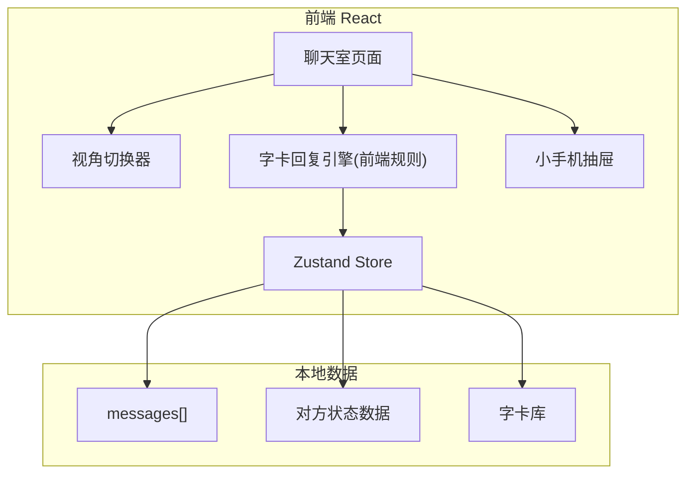

## 1. 架构设计



纯前端单页应用，无后端。所有对话状态、对方"手机数据"、字卡库均存于前端 Zustand Store，可后续接入 LLM 替换"字卡回复引擎"。

## 2. 技术说明
- 前端：React 18 + TypeScript + Vite + Tailwind CSS 3
- 状态管理：Zustand
- 路由：React Router DOM（单页，仅 `/`）
- 图标：lucide-react
- 动画：CSS 为主（视角翻转、卡片翻面、抽屉滑入）
- 初始化工具：vite-init（react-ts 模板）

## 3. 路由定义
| 路由 | 用途 |
|-------|---------|
| `/` | 聊天室主页面（含视角切换 + 小手机抽屉） |

## 4. 数据模型（前端 Store）

### 4.1 消息
```ts
type Sender = 'me' | 'her'
interface Message {
  id: string
  sender: Sender
  type: 'text' | 'card'
  text?: string         // type=text 时我的输入
  card?: Card           // type=card 时她的字卡
  timestamp: number
}
```

### 4.2 字卡
```ts
interface Card {
  id: string
  name: string          // 卡片名，如「嗯。」
  content: string      // 卡片正文
  mood?: string         // 关联情绪
  stamp?: string        // 印章文字
}
```

### 4.3 对方状态（小手机）
```ts
interface HerStatus {
  body: {
    temp: number        // 体温
    heartRate: number   // 心率
    sleepHours: number  // 昨晚睡眠
    fatigue: number     // 疲惫度 0-100
    heartRateHistory: number[]
  }
  mood: {
    current: string     // 当前心情标签
    keyword: string     // 今日关键词
    curve: number[]     // 24h 心情值
  }
  work: {
    tasks: { id: string; title: string; done: boolean }[]
    overtime: boolean
    progress: number    // 0-100
  }
  travel: {
    location: string
    weather: string
    schedule: { time: string; place: string; note?: string }[]
  }
}
```

## 5. 字卡回复引擎规则
- 维护一个分类字卡库（情绪维度：平静/开心/疲惫/烦躁/害羞；话题维度：问候/询问/拒绝/答应/沉默）。
- 玩家消息经简单关键词匹配 → 命中分类 → 从该分类随机抽 1 张。
- 部分卡片为"情境卡"，仅在特定上下文（如连续 3 条玩家消息）触发。
- 抽卡有 0.8–1.5s 的"翻卡中"加载动画，强化拟真感。

## 6. 视角切换实现
- Store 中 `view: 'me' | 'her'`。
- 切换时整页 `transform: rotateY(180deg)` 翻转动画。
- 我的视角：我消息靠右（米黄气泡），她字卡靠左（卡牌样式）。
- 她的视角：她字卡靠右，我消息靠左（变为对方眼中的我）。

## 7. 小手机抽屉实现
- 桌面端：右侧固定宽度抽屉（360px），可拉出/收起。
- 手机内部为标签页：身体状况 / 心情 / 工作 / 出行。
- 每条对话后，对方状态数据有微小随机扰动（如心情曲线追加一个点），制造"活着"的感觉。
